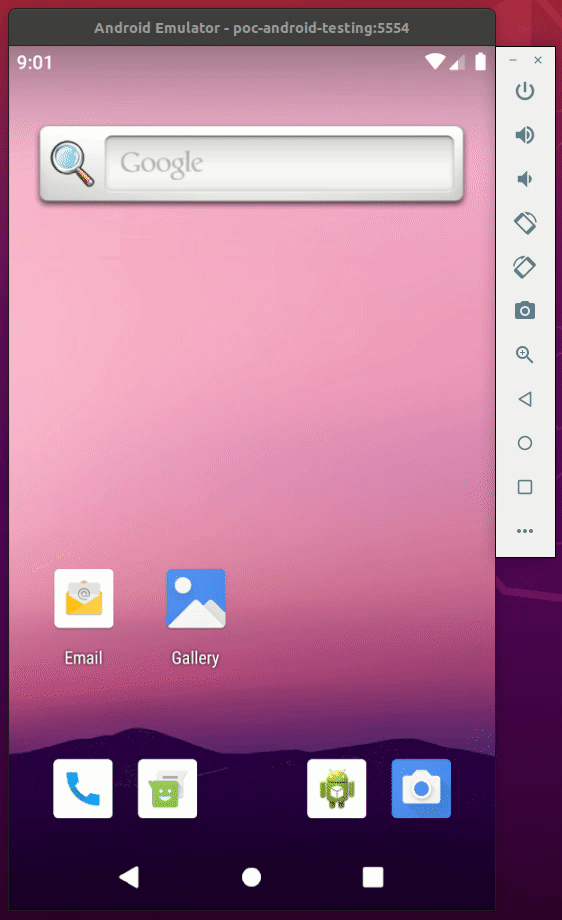

# POC: React Native Testing 2

It demonstrates how to write unit tests and UI tests to a React Native application.

The user should be able to fill a form and click a button to create a customer. Clicking in an item of the customers list removes the user.

We want to write unit tests to UI code that interacts with a backend, validates user input and updates the UI conditionally. We also want to simulate user behavior in an actual Android device using an emulator.

Components are tested using [react-native-testing-library](https://github.com/callstack/react-native-testing-library), Hooks are tested using [Testing Library](https://github.com/testing-library/react-hooks-testing-library) and API calls are tested using [Axios Mock Adapter](https://github.com/ctimmerm/axios-mock-adapter). The emulator is provisioned using [Android Virtual Devices](https://developer.android.com/studio/run/emulator-commandline) (AVD) and the tests are based on [Detox](https://github.com/wix/Detox) and [Jest](https://github.com/facebook/jest).

## How to run

| Description | Command |
| :--- | :--- |
| Install dependencies | `npm install` |
| Run unit tests | `npm test` |
| Run UI tests | `make e2e-run` |
| Create the emulator | `make create`  |
| Delete the emulator | `make delete`  |
| Start the emulator | `make device`  |
| Start the backend | `make backend-run` |

> Note: The backend should be running before the UI tests. The emulator also must be created to run the UI tests.

## Preview

